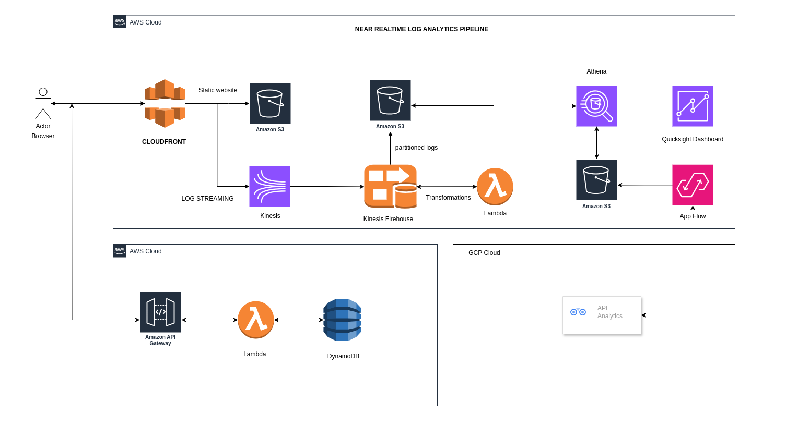
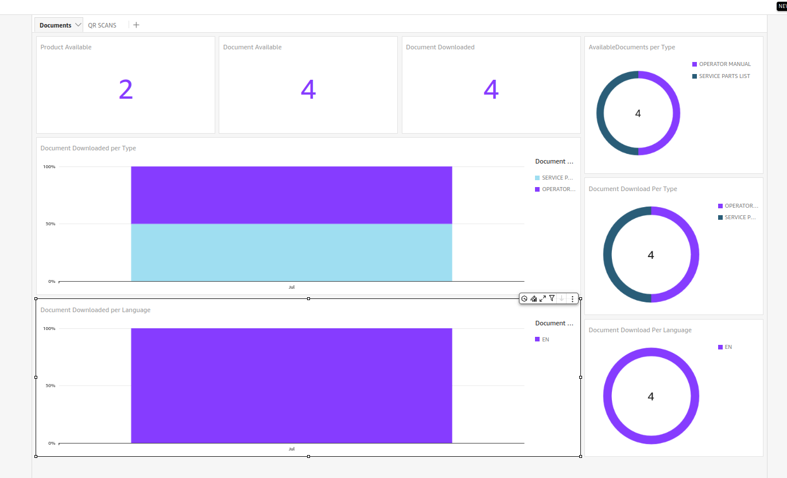
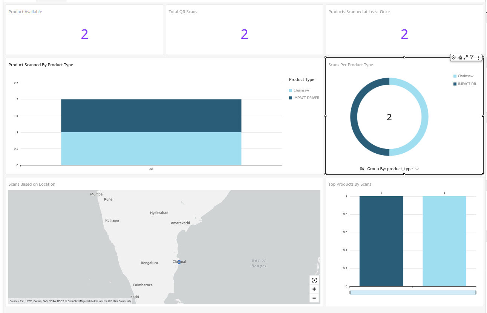

    
    <h2 align="center"> Analytics Pipeline </h2>
    

## Architecture Overview
This project implements a real-time log analytics pipeline using AWS services to monitor and analyze user interactions on a static website hosted on S3 via CloudFront. The pipeline includes near real-time analytics using QuickSight, product page usage stats using API Gateway, Lambda, and DynamoDB, as well as integration with Google Analytics using AWS AppFlow.

 

### Components:

### Components:

1. **S3 & CloudFront**:
   - Serves the static website and captures user interaction logs via CloudFront.

2. **Kinesis Data Streams**:
   - Streams CloudFront logs in near real-time for processing.

3. **Kinesis Data Firehose**:
   - Ingests and transforms data from Kinesis Data Streams.
   - Enriches logs with geographical details and converts them to Parquet format.
   - Partitions data by `event_type/year/month/date`.

4. **S3 Storage**:
   - Stores transformed logs in partitioned folders for efficient querying.
   - Stores data extracted from Google Analytics via AWS AppFlow.

5. **AWS Glue Crawler**:
   - Scans the S3 bucket to detect and update partitions for the Athena tables.
   - Scheduled to run every 24 hours to keep partition information up-to-date.

6. **AWS Glue Jobs**:
   - Runs daily jobs to optimize small files and compact them into larger ones for efficient querying.

7. **Athena & QuickSight**:
   - Athena queries partitioned data in S3, including logs and data from Google Analytics.
   - QuickSight visualizes near real-time analytics.

8. **API Gateway, Lambda, DynamoDB**:
   - Processes and stores immediate usage stats for the product page.

9. **AWS AppFlow**:
   - Integrates with Google Analytics to extract data and store it in S3.
   - Enables analysis of Google Analytics data alongside other website interaction logs.
   
### Dashboard Demo:

## Documents Dashboard
 

## QR SCAN Dashboard
 