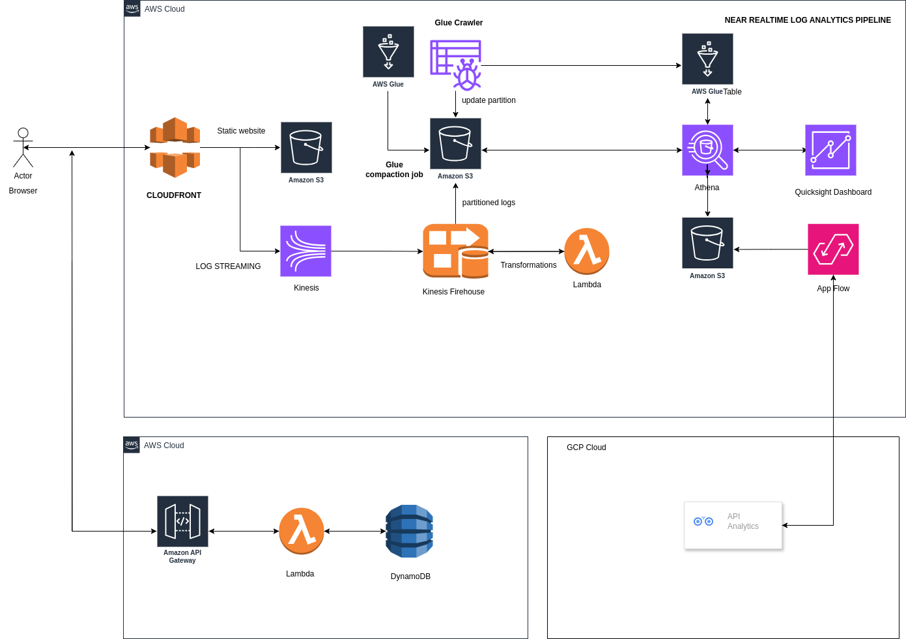

    
    <h2 align="center"> Analytics Pipeline </h2>
    

## Architecture Overview

 

### Components:

1. **S3 & CloudFront**:
   - Serves the static website and captures user interaction logs via CloudFront.

2. **Kinesis Data Streams**:
   - Streams CloudFront logs in near real-time for processing.

3. **Kinesis Data Firehose**:
   - Ingests and transforms data from Kinesis Data Streams.
   - Enriches logs with geographical details and converts them to Parquet format.
   - Partitions data by `event_type/year/month/date`.

4. **S3 Storage**:
   - Stores transformed logs in partitioned folders for efficient querying.
   - Stores data extracted from Google Analytics via AWS AppFlow.

5. **AWS Glue**:
   - Runs daily jobs to optimize small files for Athena queries.

6. **Athena & QuickSight**:
   - Athena queries partitioned data in S3, including logs and data from Google Analytics.
   - QuickSight visualizes near real-time analytics.

7. **API Gateway, Lambda, DynamoDB**:
   - Processes and stores immediate usage stats for the product page.

8. **AWS AppFlow**:
   - Integrates with Google Analytics to extract data and store it in S3.
   - Enables analysis of Google Analytics data alongside other website interaction logs.

### Why Glue Crawler Was Not Used:

AWS Glue Crawler was not used in this project for the following reasons:
- **Custom Data Transformation**: Data transformation for both CloudFront logs is managed within Kinesis Data Firehose This approach provided more control over the transformation process.
- **Parquet Format**:  data is transformed into Parquet format by Kinesis Data Firehose optimizing storage and query performance in Athena without the need for Glue Crawler.
- **Partitioning Strategy**: The partitioning strategy (`event_type/year/month/date`) was predefined and managed directly in the data processing pipeline, making Glue Crawler's dynamic schema inference less necessary.

### Dashboard Demo:

## Documents Dashboard
 

## QR SCAN Dashboard
 